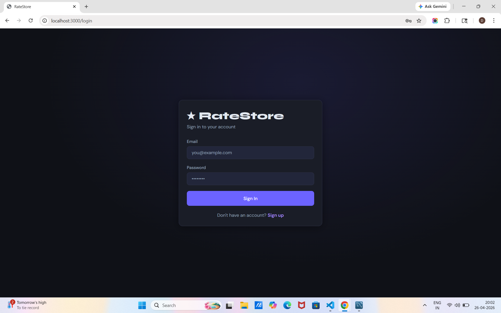
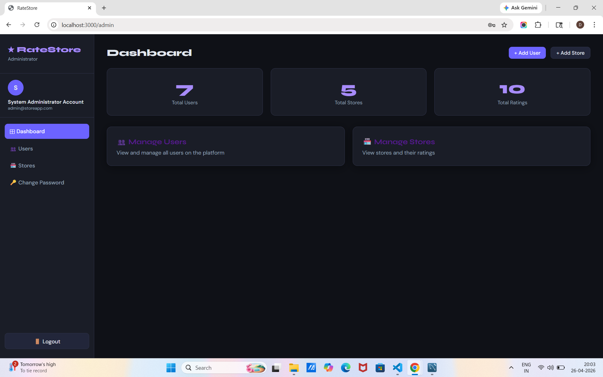
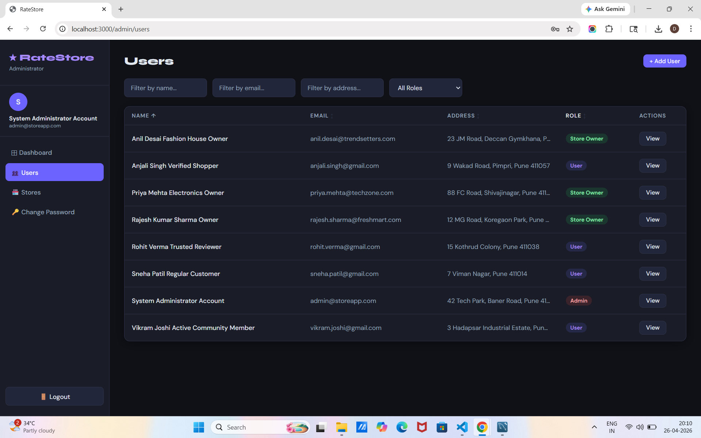
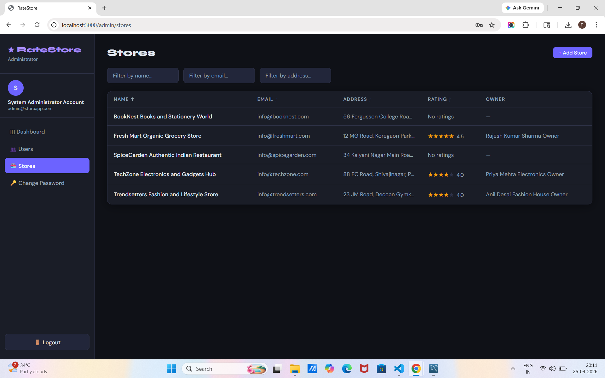
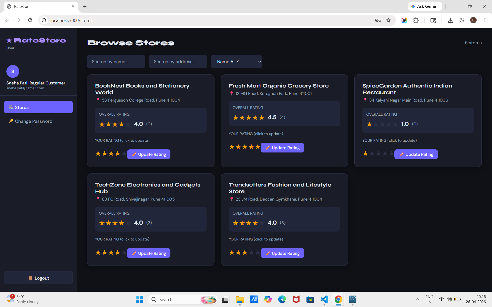
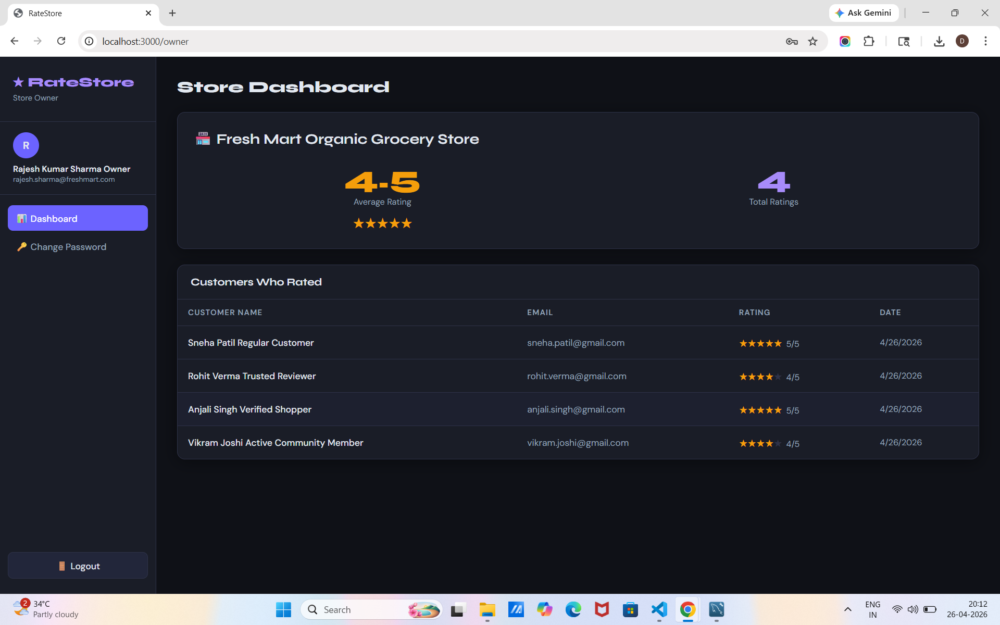

# RateStore — Store Rating Application

> A full-stack web application built for the **Roxiler Systems Full Stack Developer Challenge**
RateStore is a role-based store rating platform where customers can discover and rate local stores, store owners can track their performance, and administrators can manage the entire platform.

---

## 📸 Screenshots

### Login Page


### Admin Dashboard


### Users List


### Stores List


### Store Ratings (Normal User)


### Store Owner Dashboard


---

## 🛠️ Tech Stack

| Layer | Technology |
|-------|-----------|
| Frontend | React.js, React Router v6, Axios |
| Backend | Node.js, Express.js |
| Database | MySQL |
| Auth | JWT (JSON Web Tokens) |
| Security | bcryptjs password hashing |
| Validation | express-validator |

---

## 👥 User Roles

| Role | Access |
|------|--------|
| **Admin** | Dashboard stats, manage users & stores, view details |
| **Normal User** | Browse stores, submit & update ratings |
| **Store Owner** | View own store ratings & customer list |

---

## ✅ Features Implemented

### System Administrator
- ✅ Dashboard with total users, stores and ratings count
- ✅ Add new users (Admin / Normal User / Store Owner)
- ✅ Add new stores with optional owner assignment
- ✅ List all users with Name, Email, Address, Role
- ✅ List all stores with Name, Email, Address, Rating
- ✅ Filter listings by Name, Email, Address, Role
- ✅ Sort all tables ascending and descending
- ✅ View user details (shows store rating for Store Owners)
- ✅ Logout

### Normal User
- ✅ Register and login
- ✅ Update password
- ✅ View all stores with overall rating and own submitted rating
- ✅ Search stores by Name and Address
- ✅ Submit star rating (1 to 5)
- ✅ Modify previously submitted rating
- ✅ Logout

### Store Owner
- ✅ Login
- ✅ Update password
- ✅ View average store rating
- ✅ View list of customers who rated with their ratings
- ✅ Logout

---

## 🚀 Setup Instructions

### Prerequisites
- Node.js (v16 or higher)
- MySQL (v8 or higher)
- npm

---

### Step 1 — Clone the Repository

```bash
git clone https://github.com/YOUR_USERNAME/store-rating-app.git
cd store-rating-app
```

---

### Step 2 — Create MySQL Database

Open MySQL Workbench or terminal and run:

```sql
CREATE DATABASE store_rating_db;
USE store_rating_db;
```

Then run the schema file to create all tables:

```bash
mysql -u root -p store_rating_db < backend/src/config/schema.sql
```

---

### Step 3 — Backend Setup

```bash
cd backend
npm install
cp .env.example .env
```

Open `.env` and fill in your details:

```env
PORT=5000
DB_HOST=localhost
DB_USER=root
DB_PASSWORD=your_mysql_password
DB_NAME=store_rating_db
JWT_SECRET=your_secret_key_here
JWT_EXPIRES_IN=7d
FRONTEND_URL=http://localhost:3000
```

Seed the database with demo data:

```bash
node src/utils/seed.js
```

Start the backend server:

```bash
npm run dev
```

Backend runs on `http://localhost:5000`

---

### Step 4 — Frontend Setup

Open a new terminal:

```bash
cd frontend
npm install
npm start
```

Frontend runs on `http://localhost:3000`

---

## 🔐 Default Login Credentials

| Role | Email | Password |
|------|-------|----------|
| Admin | admin@storeapp.com | Admin@123 |
| Store Owner 1 | rajesh.sharma@freshmart.com | Owner@123 |
| Store Owner 2 | priya.mehta@techzone.com | Owner@123 |
| Store Owner 3 | anil.desai@trendsetters.com | Owner@123 |
| Normal User 1 | sneha.patil@gmail.com | User@123 |
| Normal User 2 | rohit.verma@gmail.com | User@123 |
| Normal User 3 | anjali.singh@gmail.com | User@123 |
| Normal User 4 | vikram.joshi@gmail.com | User@123 |

---

## 📁 Project Structure

```
store-rating-app/
├── backend/
│   ├── src/
│   │   ├── config/
│   │   │   ├── db.js               # MySQL connection pool
│   │   │   └── schema.sql          # Database schema
│   │   ├── controllers/
│   │   │   ├── authController.js   # Login, register, password
│   │   │   ├── adminController.js  # Admin operations
│   │   │   ├── storeController.js  # Store listing & ratings
│   │   │   └── ownerController.js  # Store owner dashboard
│   │   ├── middleware/
│   │   │   ├── auth.js             # JWT verify + role guard
│   │   │   └── validate.js         # Form validation rules
│   │   ├── routes/
│   │   │   ├── auth.js
│   │   │   ├── admin.js
│   │   │   └── stores.js
│   │   ├── utils/
│   │   │   └── seed.js             # Demo data seeder
│   │   └── index.js                # Express entry point
│   ├── .env.example
│   └── package.json
└── frontend/
    ├── public/
    │   └── index.html
    ├── src/
    │   ├── components/
    │   │   └── Layout.js           # Sidebar navigation
    │   ├── context/
    │   │   └── AuthContext.js      # Global auth state
    │   ├── pages/
    │   │   ├── LoginPage.js
    │   │   ├── RegisterPage.js
    │   │   ├── AdminDashboard.js
    │   │   ├── AdminUsers.js
    │   │   ├── AdminStores.js
    │   │   ├── AdminAddUser.js
    │   │   ├── AdminAddStore.js
    │   │   ├── AdminUserDetail.js
    │   │   ├── UserStores.js
    │   │   ├── OwnerDashboard.js
    │   │   └── ChangePassword.js
    │   ├── utils/
    │   │   └── api.js              # Axios instance
    │   ├── App.js
    │   ├── index.js
    │   └── index.css
    └── package.json
```

---

## 🔗 API Endpoints

### Auth
| Method | Endpoint | Auth | Description |
|--------|----------|------|-------------|
| POST | /api/auth/register | None | User registration |
| POST | /api/auth/login | None | Login all roles |
| PUT | /api/auth/password | Any | Update password |
| GET | /api/auth/me | Any | Get current user |

### Admin
| Method | Endpoint | Description |
|--------|----------|-------------|
| GET | /api/admin/dashboard | Stats summary |
| GET | /api/admin/users | List all users with filters |
| GET | /api/admin/users/:id | User detail |
| POST | /api/admin/users | Create new user |
| GET | /api/admin/stores | List all stores with filters |
| POST | /api/admin/stores | Create new store |

### Stores
| Method | Endpoint | Description |
|--------|----------|-------------|
| GET | /api/stores | List stores with user rating |
| POST | /api/stores/:id/ratings | Submit or update rating |
| GET | /api/stores/owner/dashboard | Owner dashboard data |

---

## 📋 Form Validation Rules

| Field | Rules |
|-------|-------|
| Name | Min 20 characters, Max 60 characters |
| Email | Standard email format |
| Password | 8–16 chars, at least 1 uppercase, 1 special character |
| Address | Max 400 characters |
| Rating | Integer between 1 and 5 only |

---

## 🗄️ Database Schema

```
users    → id, name, email, password, address, role, created_at
stores   → id, name, email, address, owner_id (FK → users)
ratings  → id, user_id (FK), store_id (FK), rating (1–5), created_at
         → UNIQUE(user_id, store_id) — one rating per user per store
```

---

## 🔒 Security Features

- Passwords hashed using **bcryptjs** (12 salt rounds)
- Authentication via **JWT tokens**
- Role-based route protection on both frontend and backend
- Environment variables for all sensitive data
- Input validation and sanitization on all endpoints
